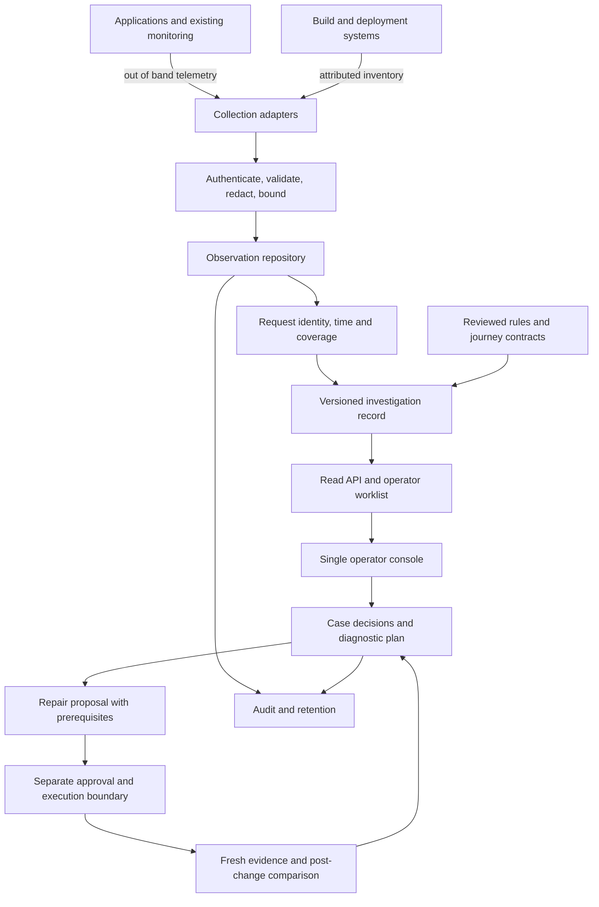

# VITALIS architecture — evidence to operator decisions

Decision date: 2026-09-10. Status: implementation baseline. This document and [32](32_Implementation_Plan.md)
supersede the sequencing and unverified capability claims in 05/06/07. The charter's
request scope, generality and evidence requirements remain binding.

## Outcome and boundaries

One operator should be able to find affected requests, inspect what happened,
identify missing evidence, follow a diagnostic procedure, prepare a reviewable
repair and verify its outcome. Reduced dependence on colleagues is a product goal;
permissions, inaccessible systems and specialist decisions still need their owners.
FIN is a proving application. AppDynamics is the organization's primary monitoring
system; an export or connector must be verified before claiming integration.

Build a modular monolith first. Keep pure evidence calculations separate from HTTP,
storage and vendor adapters. A distributed service deployment is deferred until
measured capacity, fault isolation or operational requirements justify it. The
existing Node runtime, OTLP decoders and API remain the migration anchor.

The business request never waits for the VITALIS receiver. Instrumentation still
has overhead; zero overhead is not claimed. Export failures must not fail the
business request. Execution is a distinct capability, disabled for this work.

## Modules and ownership

| Module | Contract and responsibility | Current implementation / target |
| --- | --- | --- |
| Collection | OTLP JSON/protobuf or adapter envelope; sender identity, timestamps, scope | Existing decoders and opt-in fetch observer; AppDynamics connector pending access |
| Ingestion | Authenticate source; validate shape and size; sanitize before persistence; report rejection/drop | Existing API key, body limit, sanitizer; stronger tenant/source identity is pending |
| Observation repository | Append evidence, resolve exact retries idempotently, preserve conflicts, retain time origin | D1 durable append/snapshot, D2 writer exclusion/recovery/bounds/retention hold, D3 exact retained-evidence retry selection; migration/automatic case-aware purge still pending |
| Request reconstruction | Exact parent links, unique roots, missing/duplicate/conflicting evidence, bounded calculations | Existing boundary evaluator plus new investigation module |
| Investigation | Outcome signals, root duration, gaps, deterministic next evidence steps | Pure `engine/investigation/request_investigation.js`; no network, file or command execution |
| Compatibility | Exact inventory joins, reviewed rules, per-boundary verdict and limitations | `engine/drift/relationships.js`; no service-name assumptions in rules engine |
| Operator query | Paginated worklist and detail, references back to spans | `/api/investigations` and `/api/investigations/:traceId`; authenticated reads |
| Cases | Operator annotations, acknowledgment, state transitions, optimistic revision checks | Planned; derived worklist is not a durable incident workflow |
| Diagnosis/verification | Hypotheses separated from facts; diagnostic prerequisites; matched before/after evidence | Diagnostic evidence plan first; repair verification later |
| Execution | Narrow action catalog, authenticated authority, immutable proposal, scope/expiry/rollback guards | Existing governance modules are not enabled by the console; production execution out of scope |
| Console | Worklist → request facts → gaps → next evidence → verification | Extend current served `index.html`; no frontend rewrite prerequisite |

The live API does not import demo `request_intelligence.js`, `truth_model.js` or
`request_truth_orchestrator.js`. Those contain synthetic defaults and must not be
reused as production evidence. A later extraction can retire legacy paths after
replacement acceptance tests pass. File names and historical completion prose are
not proof that a capability is active.

## Investigation contract v1

Every record has `schemaVersion`, `traceId`, deterministic `revision`, engine version,
and source context. The revision hashes semantic inputs, not evaluation wall time.
Changing source evidence changes the revision. A hash establishes reproducibility,
not sender truth, signature, append-only storage or deployment attestation.

* `shape`: observed identity tree with reasons when ambiguous. Exact duplicate
  deliveries may be collapsed within the read model; conflicting same-ID spans
  remain a gap. Arrival order is not causal order.
* `outcome`: observed root HTTP status and/or explicit OTel error. HTTP response
  class is reported as a fact, not business success. Child errors do not turn a
  successful root response into a failed business transaction.
* `timing`: root end minus root start in milliseconds with span reference. Never
  add nested/parallel spans to claim response latency. Sender precision is retained
  as decimal nanosecond strings; calculations use BigInt. Missing or ambiguous
  timing stays null/UNKNOWN. Root timing does not establish full capture, critical
  path, network time or synchronized clocks across hosts.
* `signals`: observed errors with span references; compatibility violations remain
  rule conclusions, not causal proof. No synthetic confidence or severity score.
* `gaps`: stable code, kind (`DATA`, `CAPABILITY`, `PERMISSION`, `EXPERTISE`), reason,
  and evidence references. Data absence does not prove permission denial. Permission
  and expertise constraints may be declared later with attribution; do not invent them.
* `nextSteps`: ordered, read-only evidence collection/review steps tied to gap IDs,
  expected result and validation criterion. No executable shell text or mutations.
* `coverage`: counts only the retained observed dataset. Unknown production traffic
  denominator, sampling loss, users and revenue stay unknown.

The collection contract follows the [OpenTelemetry trace API](https://opentelemetry.io/docs/specs/otel/trace/api/)
for timestamps and explicit span status. HTTP classification respects the distinction
between CLIENT and SERVER instrumentation; a 4xx alone is not inferred to be an
OTel server error. See [HTTP semantic conventions](https://opentelemetry.io/docs/specs/semconv/http/http-spans/).
Both references reviewed 2026-09-10. The investigation reports HTTP response classes
directly and does not claim that an unset OTel status means a successful business operation.

## Failure and trust model

1. Receive only on the configured collection endpoint. Telemetry fields are untrusted
   data, never instructions, links to execute or authority to control a system.
2. Redact before persistence. Do not collect request/response bodies for this slice.
   Preserve safe operation names and span references; render all strings escaped.
3. Malformed IDs, unsafe numeric timestamps, duplicate conflicts, missing root or
   missing peers yield explicit gaps. One incomplete trace cannot invent topology.
4. Read-model errors do not mutate observations or erase older records. Invalid
   inventory is visible as an analysis gap, not a clean compatibility result.
5. Initial review found swallowed journal failures and non-atomic snapshots. D1
   now fsyncs batch frames before acknowledgment, rejects failed writes before
   memory publication, and replaces snapshots by same-directory rename. This is
   local boundary. D2 adds OS-backed exclusion between cooperating server processes
   and preserves corrupt files while blocking writes. No replicated durability or
   power-loss guarantee is claimed. Full repository work remains.
6. Bound endpoint page size and refuse overlarge per-trace analysis. D2 bounds retained
   trace/observation counts, serialized bytes, journal and auxiliary signals before
   admission. Retention holds all evidence for review; it never silently purges cases.
   These are configured limits, not measured throughput or total process RSS bounds.
7. API key authentication is the current local boundary. Tenant isolation, OIDC,
   TLS termination, source trust, encryption/retention and least-privilege roles
   are production readiness prerequisites, not delivered infrastructure.

## Operator workflow and state

The read worklist separates `ERROR_OBSERVED`, `EVIDENCE_NEEDED` and `REVIEW`.
These are triage classes, not incident severity or closure states. A 200 with a
missing database peer stays EVIDENCE_NEEDED. An error with uncertain identity is
still observable at its span; its request-level outcome stays UNKNOWN.

Future cases use OPEN → INVESTIGATING → PROPOSAL_READY → AWAITING_APPROVAL →
VERIFYING → RESOLVED, with BLOCKED as an attributed condition and FAILED
verification returning to investigation. RESOLVED requires fresh comparable
evidence, stated acceptance criteria and operator confirmation. A request returning
200 after a change is not enough to prove business repair or causality.

## Implementation strategy and decision rules

Retain current APIs while adding a versioned investigation field/read API. New
operator panels use that contract; legacy baseline and timeline values are labeled
separately. Older persisted observations without newly retained raw fields remain
UNKNOWN and can be reingested from recorded original OTLP for validation.

Use real FIN recordings for one path and independently generated Node HTTP traffic
for another. Controlled malformed/error/concurrency cases are explicitly fixtures.
No dependency on an available mobile emulator, live proprietary database or vendor
account is necessary for the core phases. When an integration is blocked, record
the exact missing input, test its adapter contract locally and continue independent
core work. Never substitute fixtures for a claimed live integration result.

Capacity and availability targets will be established by measurement, not invented
numbers. Benchmarks must record workload, hardware, concurrency, loss/rejections,
storage settings and p95/p99 timings. Production launch needs operational review
and authorization beyond this local implementation.

The first bounded measurement is [D4](36_Local_Capacity_D4.md): 2,000 synthetic
observations, 10 concurrent clients, exact retry at quota, paginated investigation
reads and forced restart. It supports retaining the current local store for the
pilot; it does not establish default-limit capacity or production readiness.
